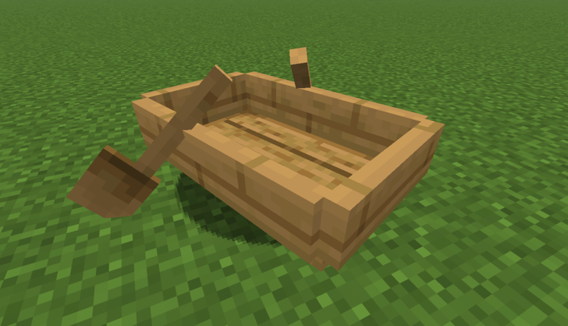

# RowingLink：用真实的划船机来开 Minecraft 里的船



各位，瞧好了。RowingLink 是一个 Fabric 小模组。它的原理其实很简单：通过 UDP 协议接收你划船机的数据，然后把你的功率和桨频转化成游戏里小船的推进力。我还加了个自动转向功能，默认是开着的，这样你就不用担心撞到岸上，只要埋头划桨就行了。当然，如果你觉得方向不对，随时可以手动拨回来。

## 软硬件要求

首先，你得有一台划船机，而且你得有办法把它的运动数据弄出来。如果你的机器支持 FTMS 协议，那事情就简单多了。我用的是 Mok Fitness K10，所以我写了个解析逻辑（就在 `rowinglink-bridge/adapters/mok_k10.py` 里），这是我对着它的蓝牙数据包逆向分析出来的。如果你用的是别的牌子，可能得自己动手写个适配器。

我得坦白，我不是什么专业的 Minecraft 模组专家，我只在下面这个环境里跑通过：

- JDK 21
- Minecraft 1\.21\.11
- Fabric API [0\.141\.3\+1\.21\.11]
- 单人游戏模式

为了让划船的感觉更真实，我还装了一堆非常棒的视觉增强模组：

- Iris [1\.10\.7\+mc1\.21\.11]
- Lithostitched [1\.6\.1]
- Sodium [0\.8\.7\+mc1\.21\.11]
- Tectonic [3\.0\.19]
- Voxy [0\.2\.13\-alpha]
- Voxy World Gen V2 [2\.2\.4]

## 安装和游玩

> 顺便提一下，[Prism Launcher](https://prismlauncher.org/) 真的很好用，管理版本和模组省了我不少事

1. 先把 [Fabric API](https://github.com/FabricMC/fabric-api) 装上
2. 运行 `./gradlew build` 来构建项目，生成的 jar 文件就在 `build/libs/` 下面
3. 把这个 jar 文件扔进你的 `${MINECRAFT_DIR}/mods/` 文件夹
4. 启动你的数据桥接工具，让它往 UDP 端口发数据
5. 进游戏，坐上船，输入 `/rowing connect`
6. 开始划吧
   - 如果你想练个二十分钟，就用 `/rowing train 20`
   - 如果你想要一点魔鬼训练，就开生存模式

## 常用命令

| 命令 | 它是干嘛的 |
|------|------|
| `/rowing connect [port]` | 启动 UDP 接收（默认 19840） |
| `/rowing disconnect` | 停止 UDP 接收 |
| `/rowing train <minutes>` | 启动按分钟计时训练（再次执行会覆盖当前训练） |
| `/rowing reload` | 重新加载 `config/rowinglink.json` |

## 配置文件

配置文件在 `config/rowinglink.json`，第一次运行它会自己跑出来。改完记得执行 `/rowing reload`。这里有几个你可能想调的参数：

- `network.udpPort`：UDP 端口
- `physics.maxSpeed`：速度上限
- `physics.dragCompensation`：水阻补偿
- `propulsion.distanceScale`：手动里程倍率
- `propulsion.distanceMatchMaxScale`：自动里程匹配上限

## 测试

```bash
./gradlew runClient
```

## AI 工具使用声明

- 项目设计和逆向分析使用了网页版本的 Google Gemini
- 项目开发过程中使用了 Claude Opus 4.6 和 GLM 5.1

## 许可证

Apache License 2\.0
